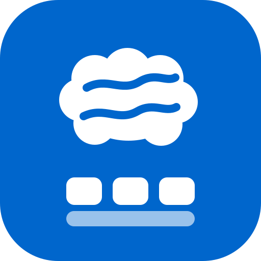
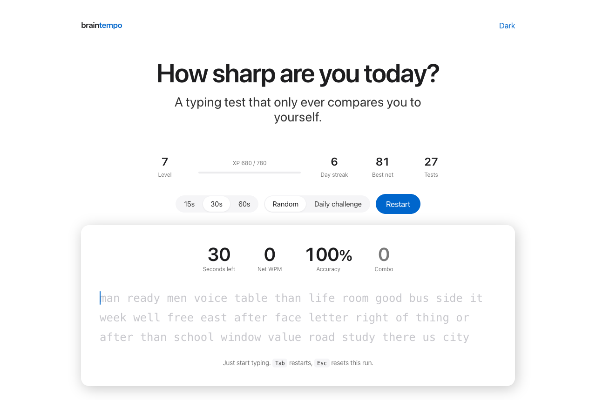
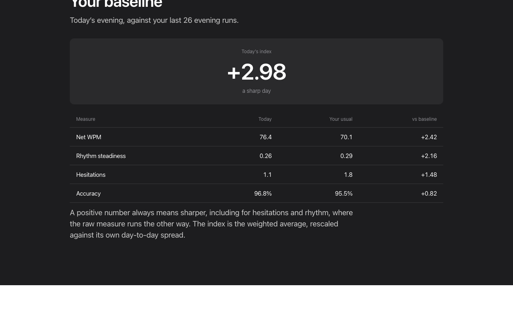
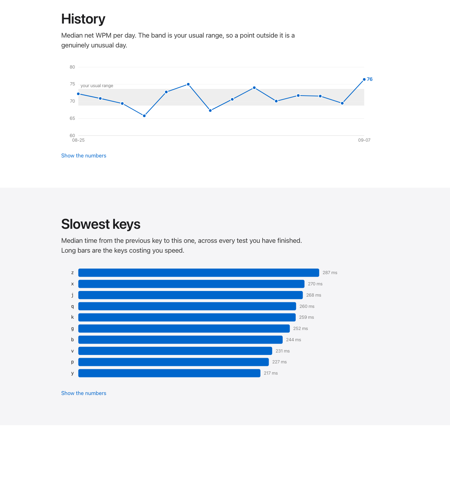

<p align="center">
  
</p>
<p align="center">
  <strong>A typing test that only ever compares you to yourself.</strong>
</p>
<p align="center">
  <a href="https://moecui22.github.io/braintempo/"></a>
  <a href="LICENSE"></a>
  
  
</p>

Most typing tests rank you against strangers.

This one only knows one person. ⌨️

<h2 align="center">
  <a href="https://moecui22.github.io/braintempo/">👉 Play it here</a>
</h2>



## ⌨️ What it watches

Type the words as they scroll. No punctuation, no capitals. 15, 30 or 60 seconds.

**Net WPM** — correct characters only. The number most tests quietly round up.

**Accuracy** — right keystrokes as a share of all of them. No dictionary, no spell
check; correctness is decided character by character against the word on screen.

**Rhythm steadiness** — the spread of the gaps between your keystrokes. Carries
more signal than raw speed does.

**Hesitations** — pauses over half a second, per hundred keys. This is the one
that moves when you are tired.

There is a combo counter, XP, levels, a day streak, 12 achievements and a daily
challenge. None of it touches the measurement. It exists so you come back
tomorrow, which is the only way any of this works. 🔥

## ⏳ Then it makes you wait

Nothing gets scored until it has **five runs from earlier days at the same time
of day**. About a week. Runs under 60 characters are shown and thrown away.

This is deliberate. Scoring you against a run from ten minutes ago measures your
warm-up, not your day.



Once it has enough, every session gets one number. **`+1.5`** is a sharp day,
**`0`** is typical, **`-1.5`** is a slow one.

Behind it: your morning is only ever compared to your mornings; the baseline is
your last 30 runs and rolls forward, so learning the format doesn't read as
getting smarter; median and MAD instead of mean and SD, so one strange day can't
bend it.



## 🔒 Your data never leaves

`localStorage`, on your machine. No account, no server, no analytics, **zero
network requests**. Export CSV or JSON whenever, erase it all with one button.

Clearing your browser data clears your history with it. Nobody can help you
recover it, including you.

## 🐍 Run it on your own typing

> [!TIP]
> **The local one gives better data.** A typing *test* has a practice curve —
> your first fortnight climbs because you are learning the format. Watching your
> **ordinary typing** has no practice curve at all. Same four measurements, same
> scoring, no test to sit.

`braintempo.py` runs in the background and costs you one macOS permission.

It never stores what you type. Keystrokes live in memory for one burst, become
timing statistics, and are discarded. The tests prove that rather than assert it:
they type known secrets through the real code path, then grep the database for
them. ✅

```bash
python3 -m pip install --user pynput
python3 braintempo.py collect     # from Terminal, then grant Input Monitoring
python3 braintempo.py report
python3 tests/test_braintempo.py  # 16 checks
```

It skips password managers, ignores anything under 15 keystrokes, and never
records a keypress with ⌘ held.

## 📁 What's in here

| Path | What it is |
|---|---|
| `docs/index.html` | The entire web app. One file, no dependencies, no build step. |
| `braintempo.py` | The background collector and its reports. |
| `tests/test_braintempo.py` | Privacy, measurement and scoring tests. |
| `assets/` | Logo and screenshots. |

## Don't game it

You can type the same easy word for thirty seconds and post a lovely number.
Nothing stops you. You would just be lying to the only person reading it.

MIT
